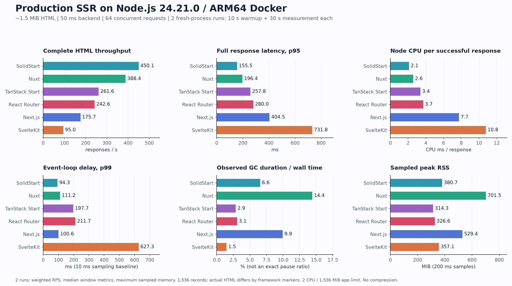
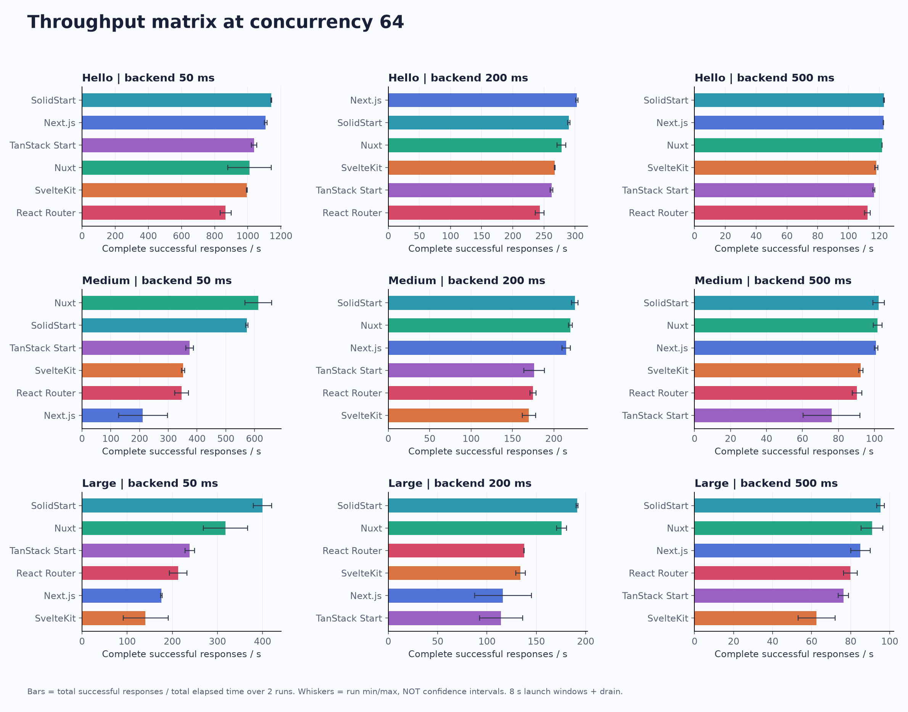
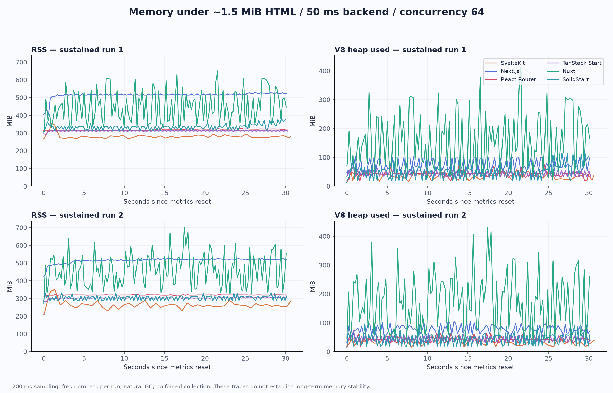

# 六种 SSR 框架 Node.js 性能实测

> **2026-09-22 修订：** SvelteKit 单独复测的三轮默认实现为 **96.9、93.4、203.5 RPS**，不能再把原两轮约 95 RPS 当作稳定容量。独立 CPU profile 中，完整 HTML 的 ETag `hash()` 占采样 self time 约 **70.4%**，不能将原端到端结果等同于组件渲染性能。下方六框架表格和图片保留 2026-09-21 的原始数据，不混入诊断变体成绩。[查看复测、公开资料核对与 ETag 对照](svelte-recheck-20260922/REPORT.md)；[原报告快照](REPORT-20260921-original.md)。

测试日期：2026-09-21。Node.js 24.21.0 / ARM64 Docker，全部使用 production 构建。完整方法、适用边界和版本见 [测试口径](METHODOLOGY.md)。

> 本报告比较这六个最小应用的具体部署组合。相同的合成记录数、后端等待和资源配置，不等于覆盖所有业务架构；不能据此直接决定迁移框架。

## 主要发现

- **本组大页面持续测中，SolidStart 吞吐最高，Nuxt 次之；内存成本不同。** 在约 1.5 MiB HTML、50 ms 后端、64 并发下，两轮持续测合并为 450.1 和 388.4 RPS；对应每请求 CPU 为 2.10 和 2.59 ms。Nuxt 的观测 RSS 峰值约 701.5 MiB，为这组持续测最高；TanStack Start 约 314.3 MiB，为最低。吞吐量与内存不能用一个总排名代替。
- **GC 比例低不等于页面处理快。** SvelteKit 的持续测 GC 时长占窗口约 1.5%，但 event loop p99 为 627.3 ms、完整响应窗口 p95 中位数为 731.8 ms。Next.js 的 ELU 达 99.8%，每请求 CPU 7.75 ms。它们反映此负载下的运行状态；9 月 21 日未采集 CPU profile，当时不能据此指认某个内部函数或推断内存泄漏；9 月 22 日已补充 SvelteKit profile，见顶部复测链接。
- **流式首字节不等于完整页面。** 在大页面、500 ms 后端、64 并发的短测中，SolidStart 的首 body 字节窗口 p50 中位数为 53.4 ms，完整 HTML 的对应值为 657.0 ms。提前输出外壳不会消除后端等待，所以本报告用完整成功响应计算 RPS。
- **原两轮持续测波动较小，但后续复测表明仍不足以判断稳定性。** 108 个重复矩阵场景中，23 个的两轮 RPS 范围超过合并值的 10%。例如 SvelteKit 大页面/50 ms/C64 的短测为 91.7–190.7 RPS，而两次新进程持续测为 92.5–97.4 RPS。不同预热与负载历史、运行时状态及宿主调度可能影响结果，具体原因尚未证实；没有删除慢样本。六框架持续测两轮的 RPS 范围相对合并值约为 0.6%–5.2%。
- **Hello World 的慢后端结果主要体现等待上限。** 500 ms 后端、64 并发的理想上限为 128 RPS；实际六框架约 112–123 RPS。不能用这个场景推断各框架的最大 SSR 容量，也不能把大页面结果外推到简单页面、所有 Next.js RSC 架构或真实业务。

正式测量共 **441,191 次成功响应、0 次错误、0 次新增 OOM kill**。所有窗口都通过页面请求与后端调用对账。后端返回紧凑的合成记录描述，在 SSR 中生成完整列表；本轮没有测试大型后端 JSON 的解析成本，也没有测试浏览器 hydration、LCP 或长期内存稳定性。

统一环境：应用单进程、2 CPU 配额、1536 MiB 内存限制；V8 old-space 1024 MiB。后端延迟 50/200/500 ms，并发 1/16/64，HTTP Keep-Alive，无压缩。框架版本：Next.js 16.3.5、Nuxt 4.5.2、SvelteKit 2.70.3、TanStack Start 1.168.56、React Router 8.4.0、SolidStart 2.0.5。

## 持续负载结果

大页面、50 ms 后端延迟、64 并发；各框架独立新进程，预热 10 秒，发压 30 秒并等待在途响应全部结束，执行两轮且第二轮反转框架顺序。下表按两轮累计成功请求 / 累计实测时间排序；延迟分位数、CPU、GC 和 ELU 为窗口指标中位数，内存为两轮观测峰值的较大值。两次重复不能提供可靠的统计置信区间。

此处每个页面只有一次 HTML 请求且每次请求调用后端一次，因此页面 QPS、成功 RPS 和按相同时间窗计算的后端调用率数值相同。没有测试数据库 QPS。

| 框架 | RPS / 页面 QPS | 两轮 RPS 范围 | 完整响应 p50 / p95 (ms) | 首 body 字节 p50 (ms) | CPU % | CPU ms/请求 |
| --- | --- | --- | --- | --- | --- | --- |
| SolidStart | 450.1 | 448.1–452.1 | 141.1 / 155.5 | 50.6 | 94.6 | 2.10 |
| Nuxt | 388.4 | 386.5–390.3 | 163.4 / 196.4 | 162.0 | 100.4 | 2.59 |
| TanStack Start | 261.6 | 260.8–262.4 | 242.1 / 257.8 | 240.8 | 88.7 | 3.39 |
| React Router | 242.6 | 241.2–244.0 | 261.4 / 280.0 | 260.1 | 89.9 | 3.71 |
| Next.js | 175.7 | 171.2–180.3 | 361.8 / 404.5 | 360.2 | 135.9 | 7.75 |
| SvelteKit | 95.0 | 92.5–97.4 | 657.5 / 731.8 | 656.0 | 102.2 | 10.78 |

| 框架 | ELU % | Event loop p99 (ms) | GC 次/秒 | GC ms/千请求 | GC 时长占窗口 % | RSS 峰值 (MiB) | heap 峰值 (MiB) |
| --- | --- | --- | --- | --- | --- | --- | --- |
| SolidStart | 71.0 | 94.3 | 40.9 | 145.7 | 6.6 | 380.7 | 120.3 |
| Nuxt | 77.6 | 111.2 | 31.8 | 371.2 | 14.4 | 701.5 | 430.8 |
| TanStack Start | 80.6 | 197.7 | 36.9 | 109.8 | 2.9 | 314.3 | 74.0 |
| React Router | 82.4 | 211.7 | 41.1 | 127.1 | 3.1 | 326.6 | 75.0 |
| Next.js | 99.8 | 100.6 | 34.8 | 566.6 | 9.9 | 529.4 | 106.6 |
| SvelteKit | 92.9 | 627.3 | 14.3 | 156.1 | 1.5 | 357.1 | 58.4 |

CPU 100% 表示一个核心，应用上限 200%。Event loop 以 10 ms 分辨率采样，约 10 ms 是测量基线；GC 时长占比不是精确的暂停时间占比。RSS/heap 峰值为观测峰值，不是操作系统记录的瞬时历史最高值。

## 全部页面与后端延迟的吞吐量

下表统一为 64 并发。每格按两次 8 秒发压窗口及排空时间计算 `Σ成功请求 / Σ实测时间`，单位 RPS。不要跨不同后端延迟的格子直接排名；等待占比高时，上限主要由并发与后端延迟决定。64 并发下，只考虑 50/200/500 ms 等待的理想上限分别是 1280/320/128 RPS，实际还需支付渲染与传输成本。

| 页面 | 后端延迟 (ms) | Next.js | Nuxt | SvelteKit | TanStack Start | React Router | SolidStart |
| --- | --- | --- | --- | --- | --- | --- | --- |
| Hello World | 50 | 1108.3 | 1011.0 | 994.7 | 1037.8 | 865.9 | 1142.1 |
| Hello World | 200 | 303.1 | 278.3 | 267.2 | 262.2 | 243.2 | 290.3 |
| Hello World | 500 | 122.7 | 121.8 | 118.1 | 116.5 | 112.4 | 123.1 |
| 约 800 KiB | 50 | 211.2 | 613.2 | 351.2 | 374.6 | 346.7 | 573.3 |
| 约 800 KiB | 200 | 215.0 | 220.1 | 169.9 | 176.0 | 174.7 | 225.4 |
| 约 800 KiB | 500 | 100.9 | 101.8 | 92.5 | 76.4 | 90.3 | 102.4 |
| 约 1.5 MiB | 50 | 175.9 | 317.8 | 140.5 | 238.6 | 213.2 | 400.0 |
| 约 1.5 MiB | 200 | 116.0 | 175.6 | 134.0 | 114.0 | 137.6 | 191.4 |
| 约 1.5 MiB | 500 | 85.0 | 91.0 | 62.4 | 76.3 | 79.9 | 95.3 |

图中误差线表示两轮的最小/最大值，不是置信区间。16 并发和低并发数据保存在 [全部场景汇总 CSV](summary.csv) 与 [逐窗口 CSV](runs.csv)。

### 大页面、50 ms：并发与波动

| 框架 | C=1 RPS | C=16 RPS | C=64 RPS | C=64 两轮范围 | C=64 窗口 p95 中位数 (ms) |
| --- | --- | --- | --- | --- | --- |
| Next.js | 15.9 | 158.9 | 175.9 | 174.3–177.6 | 407.0 |
| Nuxt | 14.8 | 194.6 | 317.8 | 268.7–366.7 | 395.7 |
| SvelteKit | 14.7 | 100.3 | 140.5 | 91.7–190.7 | 635.5 |
| TanStack Start | 14.5 | 142.6 | 238.6 | 227.9–249.5 | 304.1 |
| React Router | 13.8 | 141.2 | 213.2 | 194.0–232.9 | 383.0 |
| SolidStart | 15.6 | 214.7 | 400.0 | 379.8–420.6 | 201.5 |

窗口 p95 的中位数不是全部请求合并后的 p95。C=1 只运行一次 6 秒；尤其 500 ms 场景请求数少，仅用作低负载延迟参考。矩阵使用经过前序负载的同一进程，内存比较优先参考上面的新进程持续测。

## 实际 HTML 体积和页面内容

| 框架 | Hello World | 中页面：800 条记录 | 大页面：1536 条记录 |
| --- | --- | --- | --- |
| Next.js | 4,859 B | 794.4 KiB | 1.486 MiB |
| Nuxt | 1,405 B | 791.0 KiB | 1.483 MiB |
| SvelteKit | 905 B | 790.5 KiB | 1.482 MiB |
| TanStack Start | 1,400 B | 791.0 KiB | 1.483 MiB |
| React Router | 2,741 B | 792.3 KiB | 1.484 MiB |
| SolidStart | 1,887 B | 817.9 KiB | 1.533 MiB |

记录字段、文本长度和组件层级相同。SolidStart 等框架添加的 hydration 标识造成一定体积差异；保留这些实际部署成本，没有靠减少记录数对齐字节数。

**后端返回的是紧凑的记录生成描述，列表在每次 SSR 时生成。没有测试大型后端 JSON 的解析，也没有测浏览器 hydration、LCP、CDN、TLS 或压缩。** Next.js 使用 App Router + Client Component 的 SSR HTML 路径，不能将结果等同于纯 RSC 页面。React Router 使用带默认访问日志的官方 serve；TanStack/SolidStart 使用 Nitro 3 beta。

## 内存、GC 与观测边界

这些曲线来自两轮 30 秒窗口和自然 GC，没有手动强制回收。RSS 保留/增长可能来自 V8 堆扩容、native buffer、分配器及共享页，单凭 RSS 不能判断泄漏。GC 原始计数、major/minor/incremental 分类、每千请求 GC 时长、heap 起止值、cgroup 内存均保存在原始 JSON 和逐窗口 CSV 中。

## 测量有效性

| 检查项 | 实测结果 |
| --- | --- |
| 覆盖 | 162 个独立矩阵场景；270 个矩阵窗口 + 12 个持续窗口 |
| 正式窗口内完整且校验成功的响应 | 441,191 次 |
| HTTP / 内容校验 / 网络错误 | 0 |
| 后端对账 | 所有窗口：发出 = 完整响应 = 成功校验 = 后端请求 = 后端完成；无遗留在途请求 |
| OOM kill | 应用、后端、压测器所有窗口均无新增 OOM kill |
| 应用 CPU throttling 累计 | 0.0 ms |
| 压测器最高窗口平均 CPU | 92.4% / 400% 配额 |
| 压测器 CPU throttling 累计 | 0.0 ms |
| 后端最高窗口平均 CPU | 10.0% / 200% 配额 |
| 后端实际平均等待的最大超出量 | 6.72 ms（相对于配置的 50/200/500 ms） |
| 后端实际 p95 等待的最大超出量 | 68.24 ms |
| 主要重复中吞吐范围超过加权均值 10% 的场景 | 23 / 108；详见 health.json |

闭环固定并发不会展示恒定到达率下无限增长的排队，因此“本次最高 RPS”不是满足某个线上 SLA 的极限容量。没有长期压力、突发流量、跨进程扩容或 x86 验证。

## 复现与清理

执行步骤、生成器、负载器、验收脚本及确切依赖锁文件见 [复现说明](reproduce/README.md)。[原始证据目录](evidence/) 保留每个窗口的监控摘要和 200 ms 内存采样，以及构建与运行日志。

清理状态由 [cleanup.json](evidence/cleanup.json) 和 [local-cleanup.json](evidence/local-cleanup.json) 记录。生成的应用、production 产物、依赖、npm 缓存、HTML 测试数据和本次 Docker 容器/卷/网络均属于一次性资源；只保留报告、指标证据和复现代码。已有基础镜像保留。
