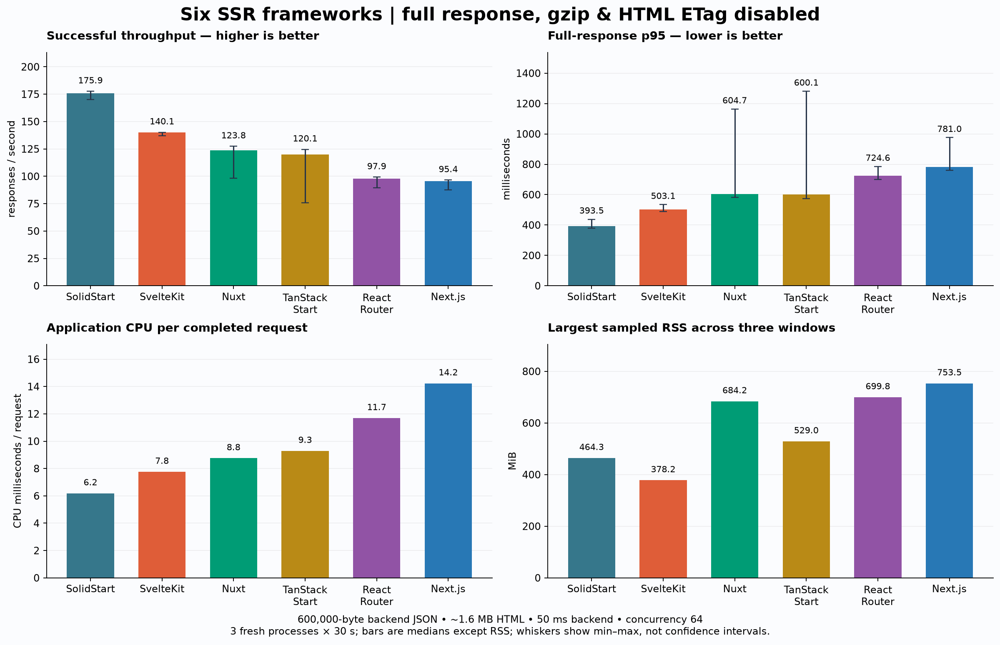
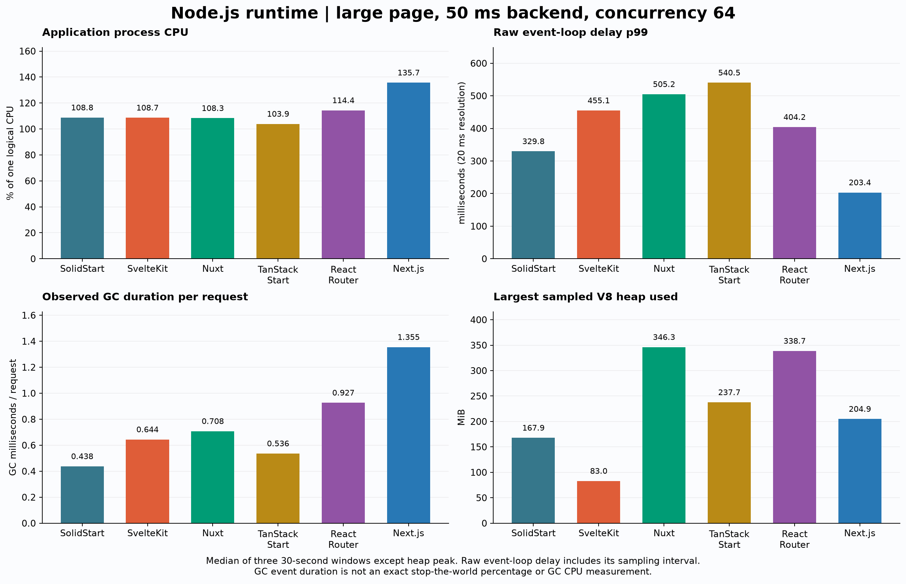
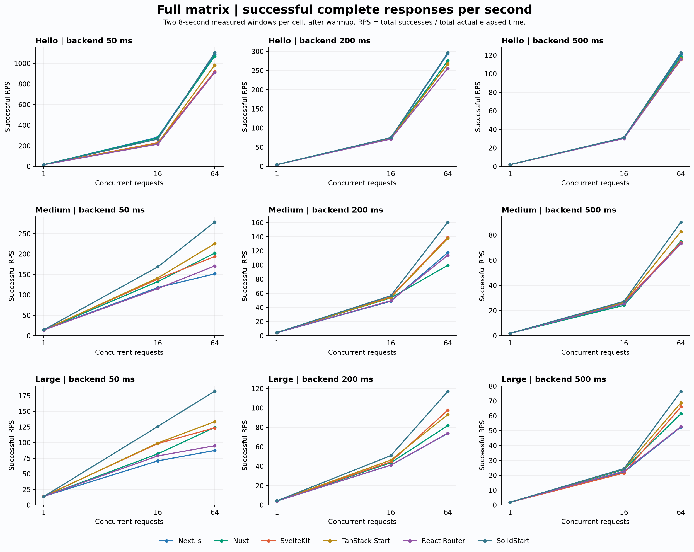
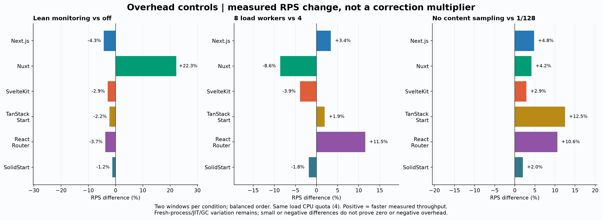

# 六种 SSR 框架 Node.js 性能复测：关闭压缩与 HTML ETag

测试日期：2026-09-22。所有结果均为本机 Docker production 构建实测，模拟后端通过 HTTP 返回 320 KB / 600 KB 完整 JSON，使用统一轻量监控和低开销压测器。SvelteKit 使用明确记录的 ETag 计算补丁；此处不是六种框架默认配置的排名。

完成 **402 个测量窗口、447,347 个有效完整响应、0 个请求错误/校验失败**，其中 741 次开销对照请求附加了内容抽样；另完成 216 次压测前完整页面验收。正式矩阵和重点复核不在计时窗口内扫描内容；每个测量窗口后端调用数均与页面请求数一致。

## 主要结果

以下为大页（后端 JSON 600,000 字节、响应 HTML 约 1.6 MB）、后端 50 ms、并发 64 的 **3 个独立新进程 × 30 秒**结果，每个新进程先暖机 30 秒。吞吐和延迟列是窗口指标的中位数，括号为三次吞吐最小–最大值；p95 不是合并所有请求后重新计算的分位数。

| 框架 | 有效 RPS：中位数（范围） | 完整响应 p50 ms | p95 ms | p99 ms | CPU ms/请求 | 采样 RSS 最大 MiB |
| --- | --- | --- | --- | --- | --- | --- |
| SolidStart | 175.9 (170.1–177.7) | 359.2 | 393.5 | 444.1 | 6.2 | 464.3 |
| SvelteKit | 140.1 (137.1–140.2) | 453.7 | 503.1 | 567.2 | 7.8 | 378.2 |
| Nuxt | 123.8 (98.1–127.4) | 510.2 | 604.7 | 782.3 | 8.8 | 684.2 |
| TanStack Start | 120.1 (75.7–124.6) | 517.0 | 600.1 | 823.7 | 9.3 | 529.0 |
| React Router | 97.9 (89.7–99.2) | 647.0 | 724.6 | 768.1 | 11.7 | 699.8 |
| Next.js | 95.4 (87.4–96.5) | 656.1 | 781.0 | 998.8 | 14.2 | 753.5 |

在这个限定场景中，SolidStart 的吞吐中位数最高，为 175.9 RPS，进程 CPU 成本为 6.19 ms/请求。SvelteKit 为 140.1 RPS，完整响应 p95 的窗口中位数为 503.1 ms；这里已经移除 HTML ETag 哈希，并实际传输与解析 600 KB 后端 JSON。

这里的 503.1 ms 不是纯 render 时间。在接近满并发的闭环负载下，`并发 / RPS` 可近似检查平均响应时长的数量级：SvelteKit 的 `64 / 140.1` 约为 457 ms。该关系不能用于推导 p95，也不能拆分 JSON 解析、渲染和序列化阶段。

相邻框架中，Nuxt / TanStack Start、TanStack Start / React Router、React Router / Next.js 的三次吞吐范围有重叠，顺序不宜解读得过细；这些范围不是置信区间。

**跨进程波动仍未消除。** Nuxt 和 TanStack Start 各有一个明显较慢的重点窗口，均完整保留。较慢窗口同时出现每请求 CPU 成本上升；当时后端计时器平均等待仍约 53–56 ms，响应字节及请求计数无异常。缺少对应的 CPU profile 和宿主机调度/频率记录，尚不能分离 JIT、GC、应用内部路径与主机因素，不能把中间组的排序当作稳定承诺。详见 [异常窗口证据](rerun-20260922-noetag-json/evidence/variability.json)。

框架顺序只对应这一合成场景。相同业务记录产生的框架原生 HTML/hydration 格式略有不同；响应字节不是人为补齐到完全相等。更大的数据对象、字段结构、组件复杂度、缓存策略与部署环境均可能改变顺序。

## Node.js 运行时

| 框架 | 进程 CPU% | ELU% | event-loop delay p99 ms | GC ms/请求 | GC 次数 / 最长事件 ms（三窗） | heap 最大 MiB | external 最大 MiB | 首 body p50 ms |
| --- | --- | --- | --- | --- | --- | --- | --- | --- |
| SolidStart | 108.8 | 89.7 | 329.8 | 0.438 | 3624 / 12.6 | 167.9 | 110.4 | 154.8 |
| SvelteKit | 108.7 | 89.5 | 455.1 | 0.644 | 3963 / 10.5 | 83.0 | 111.2 | 452.7 |
| Nuxt | 108.3 | 91.8 | 505.2 | 0.708 | 2697 / 29.0 | 346.3 | 23.2 | 508.8 |
| TanStack Start | 103.9 | 92.7 | 540.5 | 0.536 | 3523 / 34.7 | 237.7 | 103.1 | 516.3 |
| React Router | 114.4 | 93.8 | 404.2 | 0.927 | 3613 / 23.2 | 338.7 | 94.8 | 645.4 |
| Next.js | 135.7 | 99.8 | 203.4 | 1.355 | 2952 / 95.6 | 204.9 | 250.7 | 652.7 |

CPU 以单个逻辑核的 100% 为基准。event-loop delay 是 20 ms 分辨率下的原始值；GC 时长不是精确的暂停比例或 GC CPU 占比。内存为每秒采样，可能遗漏瞬时峰值。首 body 可能只是流式外壳，不等于页面渲染完成。

## 覆盖全部页面、后端延迟和并发

3 种页面 × 50/200/500 ms 后端延迟 × 1/16/64 并发 × 6 框架，完整矩阵跑两轮，每个单元每轮 8 秒，暖机不计入。第二轮反转框架顺序，单元采用固定种子打乱。

[查看 162 个组合的详细表](rerun-20260922-noetag-json/RESULTS.md)。矩阵 RPS 使用两窗总成功数除以总实际时间；延迟列是两个窗口分位数的中位数，绝不是总体分位数。低并发、高后端延迟单元样本较少，不能用其 p99 做精细排名。

## 监控与压测器开销对照

下表是对应两次窗口 RPS 中位数之间的差值。正值表示左侧条件在本次对照中更快，不是理论优化收益，更不是用于修改原始分数的系数。监控为 lean/off/off/lean 的四个新进程；客户端对照在同一个暖机进程按正序/反序进行。

| 框架 | lean 相对 off | 8 worker 相对 4 | 取消 1/128 抽样相对默认 |
| --- | --- | --- | --- |
| Next.js | -4.3% | +3.4% | +4.8% |
| Nuxt | +22.3% | -8.6% | +4.2% |
| SvelteKit | -2.9% | -3.9% | +2.9% |
| TanStack Start | -2.2% | +1.9% | +12.5% |
| React Router | -3.7% | +11.5% | +10.6% |
| SolidStart | -1.2% | -1.8% | +2.0% |

客户端对照完成后，在第一个正式矩阵窗口开始前，六框架统一采用 **最多 4 worker、关闭内容抽样扫描**（并发 1 时为 1 worker）；保留每个响应的状态、字节、响应头及后端调用数检查。这样进一步降低压测器计算开销。决定和当时的数据见 [protocol-amendment.json](rerun-20260922-noetag-json/evidence/protocol-amendment.json)。上表 1/128 抽样仅是客户端对照的参考条件，也用于两种监控模式的对照，不是正式矩阵配置。

全体测量窗口中，压测器 CPU 最大 40.3%（配额 400%），单 worker ELU 最大 9.8%；后端 CPU 最大 9.9%（配额 200%），后端平均计时器等待相对设定值的最大超出为 23.10 ms。单窗口内存采样调用的累计墙钟耗时最大 36.41 ms，不能直接当作纯 CPU 开销。这些数据和对照用于检查瓶颈，不能证明所有系统开销已消失。

| 容器角色 | cgroup 周期总数 | 发生限流的周期数 | 累计 throttled ms |
| --- | --- | --- | --- |
| app | 40523 | 3 | 13.4 |
| load | 34454 | 0 | 0.0 |
| backend | 32529 | 0 | 0.0 |

所有窗口均检查 OOM 事件。cgroup 统计跨越窗口边界辅助采样，进程 CPU 主指标来自应用自身。少量吞吐差异也可能来自 JIT、GC、进程初始状态和宿主机调度；仅两次对照不足以为每个框架确定精确监控损耗率，报告保留原始观测，不做人工数值矫正。

## 实际数据量与版本

| 框架 | Hello HTML bytes | 中页 HTML bytes | 大页 HTML bytes |
| --- | --- | --- | --- |
| Next.js | 4,878–4,881 | 856,000–856,003 | 1,610,301–1,610,304 |
| Nuxt | 1,402–1,403 | 853,894–853,895 | 1,609,605–1,609,606 |
| SvelteKit | 902–902 | 834,421–834,421 | 1,572,533–1,572,533 |
| TanStack Start | 1,414–1,415 | 841,329–841,330 | 1,585,879–1,585,880 |
| React Router | 2,708–2,708 | 859,944–859,944 | 1,626,678–1,626,678 |
| SolidStart | 1,900–1,901 | 868,814–868,815 | 1,638,921–1,638,922 |

后端分别为 41、320,000、600,000 字节，中页 800 条商品、大页 1,536 条商品。所有框架从后端接收同一结构；预生成的 mock JSON 降低后端序列化瓶颈，应用 JSON 解析、SSR 和 hydration 序列化仍逐请求发生。

| 框架 | 实际安装的主要依赖 |
| --- | --- |
| Next.js | next 16.3.5；react 19.3.0；react-dom 19.3.0 |
| Nuxt | nuxt 4.5.2；vue 3.5.41；nitropack 2.13.4；vite 8.3.0 |
| SvelteKit | svelte 5.57.1；@sveltejs/kit 2.70.3；@sveltejs/adapter-node 5.5.7；vite 8.3.0 |
| TanStack Start | react 19.3.0；react-dom 19.3.0；nitro 3.0.260903-beta；@tanstack/react-start 1.168.56；@tanstack/react-router 1.170.38；vite 8.3.0 |
| React Router | react 19.3.0；react-dom 19.3.0；react-router 8.4.0；@react-router/express 8.4.0；express 5.2.1；vite 8.3.0 |
| SolidStart | nitro 3.0.260903-beta；@solidjs/start 2.0.5；solid-js 1.9.15；@solidjs/router 1.0.0；vite 8.3.0 |

运行环境：Node.js v24.21.0、Docker 29.4.0、OrbStack / aarch64（10 vCPU，7.8 GiB）。应用 2 CPU/1,536 MiB，压测器 4 CPU/1 GiB，后端 2 CPU/512 MiB，三者使用不重叠的虚拟 CPU 集。每次仅运行一个被测框架。镜像摘要、系统信息与依赖 lockfile 均保留。

## 解释边界

- 本轮测量包含模拟后端拉取、完整 JSON 解析、原生 HTML 渲染与数据序列化；未对六框架内部阶段进行等价插桩，不能拆出可信的“纯序列化毫秒数”。总 p95 减去后端延迟也不能得到 render p95。
- 动态 HTML/API 请求路径不做 gzip/br 或 ETag 计算；未请求的静态资源、构建指纹不在压测范围。压测前的主动 Accept-Encoding 测试与探针无触发记录，正式压测移除重型探针。
- SvelteKit 改的是生产产物中的 HTML ETag 计算点。该结果用于比较禁用附加计算后的 SSR 链路，不能替代默认 SvelteKit 的生产表现。
- 所有结果是闭环固定并发下的观测，不是开放到达率负载下的容量 SLA；达到饱和时，请求队列会显著抬高 p95。
- 新旧实验同时改变了后端 JSON、页面组成、监控和压测器，不能把两者差值全部归因于关闭 ETag 或 gzip。公开 benchmark 也不构成对本次数据的校正依据。
- 8 秒矩阵窗和 30 秒重点窗不证明长时间稳定性、内存泄漏情况、浏览器 hydration 性能或真实业务页面体验。

## 资料与复现

- [测量协议、指标定义和关闭方式](rerun-20260922-noetag-json/METHODOLOGY.md)
- [全部组合结果](rerun-20260922-noetag-json/RESULTS.md) / [机器可读汇总](rerun-20260922-noetag-json/summary.json) / [健康检查](rerun-20260922-noetag-json/health.json)
- [逐窗口原始结果](rerun-20260922-noetag-json/runs/) / [构建、验收和清理证据](rerun-20260922-noetag-json/evidence/)
- [复现说明](rerun-20260922-noetag-json/reproduce/README.md) / [完整脚本](rerun-20260922-noetag-json/reproduce/)
- [图片：概览](rerun-20260922-noetag-json/overview.png)、[矩阵](rerun-20260922-noetag-json/matrix.png)、[运行时](rerun-20260922-noetag-json/runtime.png)、[开销对照](rerun-20260922-noetag-json/overhead.png)，均附同名 SVG

本轮生成的应用、依赖、JSON 测试数据、容器和网络在结束后清理；指标证据和可复现代码保留。实际销毁回执见 [cleanup.json](rerun-20260922-noetag-json/evidence/cleanup.json)。

## 历史实验

本轮保留旧数据，不用新参数覆盖旧实验的数值：

- [本轮独立目录及原始报告](rerun-20260922-noetag-json/REPORT.md)
- [本轮之前的主报告](REPORT-20260922-before-noetag-json.md)
- [2026-09-21 初测原始报告](REPORT-20260921-original.md)
- [SvelteKit ETag 专项复核](svelte-recheck-20260922/REPORT.md)
