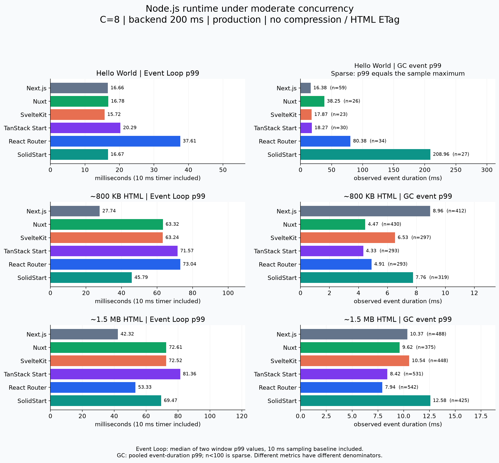
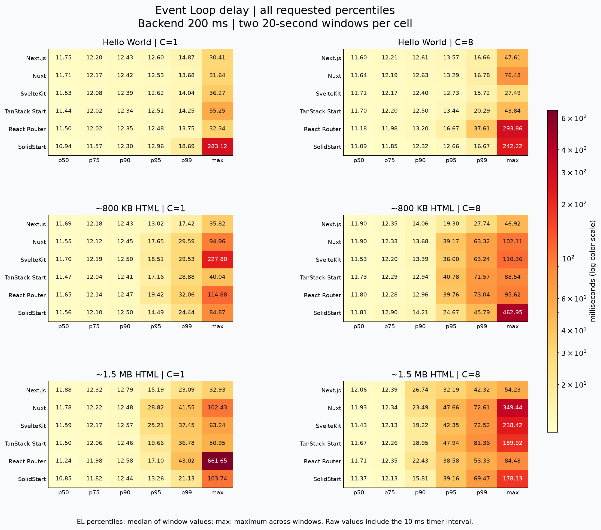
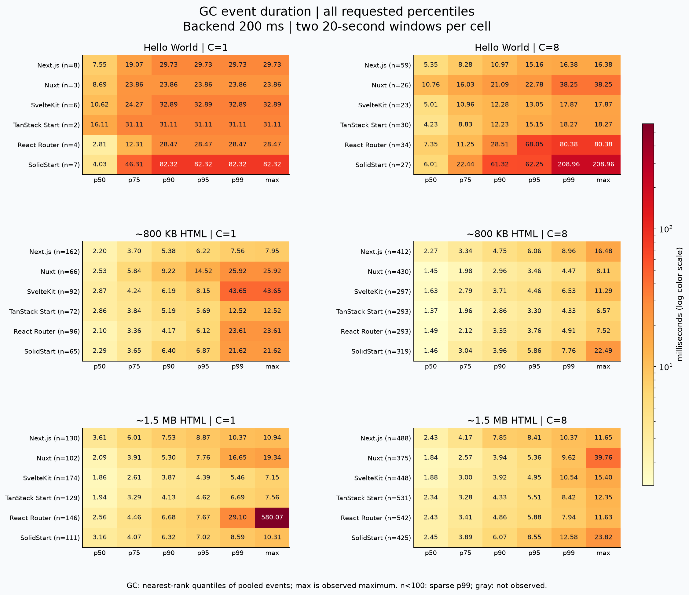
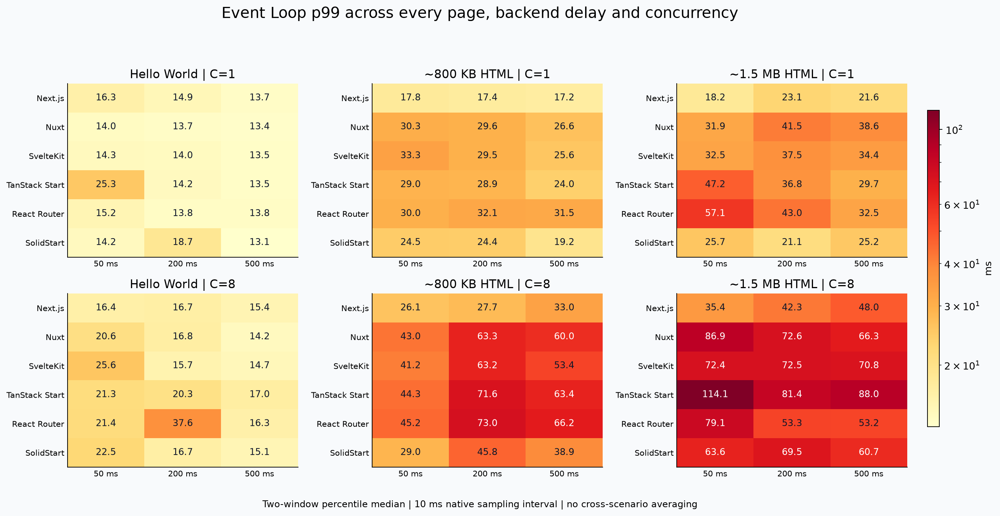

# 六种 SSR 框架：低中并发 Event Loop 与 GC 分位数实测

测试日期：2026-09-24。Docker production 构建，关闭动态 HTML/API 路径的 ETag 和压缩；并发 1/8，后端 50/200/500 ms。全部结果为新一轮实测，不复用旧测试数字。

完成 **216 个正式窗口、24 个监控开销对照、36 个空闲基线**，合计 140,677 次有效完整响应（含监控对照），请求错误 0，校验失败 0，GC 记录溢出 0。

## 本轮主要发现

**可以比较本轮具体场景，但不宜据此给六框架排一个稳定总名次。** 两轮重复、监控开销对照和原始事件均已保留；下方异常说明是结论的一部分。

在 **后端 200 ms、并发 8** 的参考切片中，EL p99 为两窗分位数均值（包含 10 ms 原生采样间隔）；GC 为两窗原始事件合并统计：

| 框架 | EL p99：Hello / 中页 / 大页 ms | 大页 CPU ms/请求 | 大页 GC ms/请求 | 大页 major GC p99 ms（N） |
| --- | --- | --- | --- | --- |
| Next.js | 16.66 / 27.74 / 42.32 | 22.28 | 1.40 | 10.64（225） |
| Nuxt | 16.78 / 63.32 / 72.61 | 17.47 | 0.76 | 8.09（121） |
| SvelteKit | 15.72 / 63.24 / 72.52 | 15.41 | 0.87 | 10.54（156） |
| TanStack Start | 20.29 / 71.57 / 81.36 | 16.93 | 1.21 | 7.50（132） |
| React Router | 37.61 / 73.04 / 53.33 | 17.27 | 1.32 | 11.13（156） |
| SolidStart | 16.67 / 45.79 / 69.47 | 13.90 | 1.08 | 9.89（140） |

1. **页面规模增长与 Event Loop 尾延迟升高一致，但不是纯 HTML 字节因果实验。** 相同框架/延迟/并发的 36 组配对中，Hello→中页、Hello→大页的 EL p99 均为 36/36 升高；中页→大页为 32/36 升高。JSON 大小、商品数量、渲染与序列化工作也同步增加，不能把全部差异归因于网络传输字节。
2. **Event Loop 较低不代表 CPU 和 GC 同时最省。** 上表中 Next.js 的中页/大页 EL p99 较低，但大页 CPU/请求 22.28 ms，高于 SolidStart 的 13.90 ms；其 GC 累计时长/请求也较高。这里只能描述所测实现的指标取舍，未证明内部调度或序列化的具体因果机制。
3. **GC 类型会改变比较结果。** 大页/200 ms/C8 的全类型 GC p99，React Router 为 7.94 ms、TanStack Start 为 8.42 ms；只看 major，则分别为 11.13 ms、7.50 ms。混合分位数受到不同类型事件比例影响，不能替代 major 指标。
4. **Hello World 的 GC p99 样本不足。** 参考切片中六框架只有 23–59 个 GC 事件，最近秩 p99 实际等于该样本最大值。全矩阵 108 个组合中，52 个组合 GC 总样本不足 100，74 个组合 major 样本不足 100，其中 1 个组合未观测到任何 GC。它们用于展示观测事实，不用于稳定尾延迟排名。
5. **并发和后端等待必须同时看。** 大页/200 ms 的 C1 下，SolidStart EL p99 为 21.13 ms、Next.js 为 23.09 ms；C8 下则分别为 69.47、42.32 ms。闭环固定并发中，等待时间变化还会改变请求完成率和对象分配速率，不能直接跨延迟档排名。

## 必须一起阅读的异常与限制

**监控开销尚不能视为可忽略。** lean/off 四窗对照中，React Router 成功完成率变化为 −24.14%，Nuxt 为 +14.27%；其他框架约为 −0.26% 至 −6.40%。这种正负不一致及窗间差异说明监控开销和进程/JIT/环境波动尚未分离。所有正式窗口使用相同监测器，但这不等于每个框架承担同样百分比的开销；没有按差值校正实测数字。

**React Router 第一轮大页有明显异常，第二轮未重复出现同等量级。** 下表保留异常，不删除慢窗口：

| 条件 | 轮次 | EL p99 / max ms | GC max ms | 应用 cgroup throttled ms 增量 |
| --- | --- | --- | --- | --- |
| 大页/50 ms/C1 | [1](runs/matrix-0-react-router-large-50-c1.json) | 90.57 / 3651.14 | 2280.49 | 764.69 |
| 大页/50 ms/C1 | [2](runs/matrix-1-react-router-large-50-c1.json) | 23.63 / 32.80 | 6.78 | 0.00 |
| 大页/200 ms/C1 | [1](runs/matrix-0-react-router-large-200-c1.json) | 54.17 / 661.65 | 580.07 | 0.00 |
| 大页/200 ms/C1 | [2](runs/matrix-1-react-router-large-200-c1.json) | 31.88 / 38.63 | 6.97 | 0.00 |
| 大页/500 ms/C1 | [1](runs/matrix-0-react-router-large-500-c1.json) | 37.55 / 223.35 | 136.10 | 0.00 |
| 大页/500 ms/C1 | [2](runs/matrix-1-react-router-large-500-c1.json) | 27.53 / 43.19 | 7.56 | 0.00 |

第一轮大页/50 ms/C1 中，最大 GC 事件为 minor 2280.49 ms，EL max 为 3651.14 ms，同时观察到 cgroup CPU 限流。仅凭这些记录不能把秒级异常归因于 React Router 固有实现，也不能证明全部由限流造成；本次未抓取 CPU profile/GC trace，原因未定位。第二轮同条件 GC max 为 6.78 ms、EL max 为 32.80 ms。
内存采样统一为 1 Hz；最异常窗口约 21 次 memoryUsage 调用累计墙钟耗时 190.29 ms。这个墙钟数包含可能的调度等待，不等于采样 CPU 时间，也说明不能宣称监控完全无干扰。相比之下，压测器最高进程 CPU 为 19.46%（100%=一核）、worker ELU 最高 8.45%，后端最高 CPU 为 7.98%；这些观测未显示压测器/后端持续 CPU 饱和。
因此，本报告的尾延迟与最大值属于本机 Docker 环境、指定版本和短窗下的真实观测。没有用 QPS 推算 GC，没有丢弃异常，也没有把差异包装为统计显著或长期上界。

## 如何读结论

这次测的是自然运行中的事件循环延迟与 GC 事件时长，不追求极限 QPS。请求实际经过后端 HTTP 等待、JSON 解析、原生 SSR 渲染和框架响应序列化；本轮没有逐阶段计时埋点，不能把 GC 或 Event Loop 数字直接解释成纯 HTML 渲染或序列化耗时。不测浏览器执行或客户端 hydration。不同框架以相同并发运行，实际完成请求量仍不同，因此既列 GC 单次时长，也列次数/秒与毫秒/请求。不要把 HTTP p99、Event Loop p99 和 GC p99 当作同一个指标。

以下重点表固定后端 200 ms、并发 8，三个页面分别展示。它是便于阅读的切片，全部 108 个组合见末尾明细。Event Loop p50–p99 是两窗指标中位数（仅两窗，数值等于两窗均值，并非合并直方图分位数），GC 是同场景原始事件合并分位数；max 均为观测到的最高值，绝非未来上界。

## Hello World

**Event Loop：单位 ms，包含 10 ms 采样间隔**

| 框架 | p50 | p75 | p90 | p95 | p99 | max |
| --- | --- | --- | --- | --- | --- | --- |
| Next.js | 11.60 | 12.21 | 12.61 | 13.57 | 16.66 | 47.61 |
| Nuxt | 11.64 | 12.19 | 12.63 | 13.29 | 16.78 | 76.48 |
| SvelteKit | 11.71 | 12.17 | 12.40 | 12.73 | 15.72 | 27.49 |
| TanStack Start | 11.70 | 12.20 | 12.50 | 13.44 | 20.29 | 43.84 |
| React Router | 11.18 | 11.98 | 13.20 | 16.67 | 37.61 | 293.86 |
| SolidStart | 11.09 | 11.85 | 12.32 | 12.66 | 16.67 | 242.22 |

**GC：单位 ms，全类型合并；N 是事件数**

| 框架 | N | p50 | p75 | p90 | p95 | p99 | max | major N |
| --- | --- | --- | --- | --- | --- | --- | --- | --- |
| Next.js | 59* | 5.35 | 8.28 | 10.97 | 15.16 | 16.38 | 16.38 | 14 |
| Nuxt | 26* | 10.76 | 16.03 | 21.09 | 22.78 | 38.25 | 38.25 | 5 |
| SvelteKit | 23* | 5.01 | 10.96 | 12.28 | 13.05 | 17.87 | 17.87 | 4 |
| TanStack Start | 30* | 4.23 | 8.83 | 12.23 | 15.15 | 18.27 | 18.27 | 5 |
| React Router | 34* | 7.35 | 11.25 | 28.51 | 68.05 | 80.38 | 80.38 | 7 |
| SolidStart | 27* | 6.01 | 22.44 | 61.32 | 62.25 | 208.96 | 208.96 | 7 |

## 中型页面（约 800 KB HTML）

**Event Loop：单位 ms，包含 10 ms 采样间隔**

| 框架 | p50 | p75 | p90 | p95 | p99 | max |
| --- | --- | --- | --- | --- | --- | --- |
| Next.js | 11.90 | 12.35 | 14.06 | 19.30 | 27.74 | 46.92 |
| Nuxt | 11.90 | 12.33 | 13.68 | 39.17 | 63.32 | 102.11 |
| SvelteKit | 11.53 | 12.20 | 13.39 | 36.00 | 63.24 | 110.36 |
| TanStack Start | 11.73 | 12.29 | 12.94 | 40.78 | 71.57 | 88.54 |
| React Router | 11.80 | 12.28 | 12.96 | 39.76 | 73.04 | 95.62 |
| SolidStart | 11.81 | 12.90 | 14.21 | 24.67 | 45.79 | 462.95 |

**GC：单位 ms，全类型合并；N 是事件数**

| 框架 | N | p50 | p75 | p90 | p95 | p99 | max | major N |
| --- | --- | --- | --- | --- | --- | --- | --- | --- |
| Next.js | 412 | 2.27 | 3.34 | 4.75 | 6.06 | 8.96 | 16.48 | 159 |
| Nuxt | 430 | 1.45 | 1.98 | 2.96 | 3.46 | 4.47 | 8.11 | 142 |
| SvelteKit | 297 | 1.63 | 2.79 | 3.71 | 4.46 | 6.53 | 11.29 | 148 |
| TanStack Start | 293 | 1.37 | 1.96 | 2.86 | 3.30 | 4.33 | 6.57 | 73 |
| React Router | 293 | 1.49 | 2.12 | 3.35 | 3.76 | 4.91 | 7.52 | 74 |
| SolidStart | 319 | 1.46 | 3.04 | 3.96 | 5.86 | 7.76 | 22.49 | 159 |

## 大型页面（约 1.5 MB HTML）

**Event Loop：单位 ms，包含 10 ms 采样间隔**

| 框架 | p50 | p75 | p90 | p95 | p99 | max |
| --- | --- | --- | --- | --- | --- | --- |
| Next.js | 12.06 | 12.39 | 26.74 | 32.19 | 42.32 | 54.23 |
| Nuxt | 11.93 | 12.34 | 23.49 | 47.66 | 72.61 | 349.44 |
| SvelteKit | 11.43 | 12.13 | 19.22 | 42.35 | 72.52 | 238.42 |
| TanStack Start | 11.67 | 12.26 | 18.95 | 47.94 | 81.36 | 189.92 |
| React Router | 11.71 | 12.35 | 22.43 | 38.58 | 53.33 | 84.48 |
| SolidStart | 11.37 | 12.13 | 15.81 | 39.16 | 69.47 | 178.13 |

**GC：单位 ms，全类型合并；N 是事件数**

| 框架 | N | p50 | p75 | p90 | p95 | p99 | max | major N |
| --- | --- | --- | --- | --- | --- | --- | --- | --- |
| Next.js | 488 | 2.43 | 4.17 | 7.85 | 8.41 | 10.37 | 11.65 | 225 |
| Nuxt | 375 | 1.84 | 2.57 | 3.94 | 5.36 | 9.62 | 39.76 | 121 |
| SvelteKit | 448 | 1.88 | 3.00 | 3.92 | 4.95 | 10.54 | 15.40 | 156 |
| TanStack Start | 531 | 2.34 | 3.28 | 4.33 | 5.51 | 8.42 | 12.35 | 132 |
| React Router | 542 | 2.43 | 3.41 | 4.86 | 5.88 | 7.94 | 11.63 | 156 |
| SolidStart | 425 | 2.45 | 3.89 | 6.07 | 8.55 | 12.58 | 23.82 | 140 |

* 表示 N<100。— 表示未观测到。major 单独分位数见 GC 明细。

## GC 类型和有限观测

| 类型 | 正式窗口事件总数 |
| --- | --- |
| minor | 7482 |
| minor_mark_sweep | 0 |
| major | 9523 |
| incremental | 9550 |
| weakcb | 0 |

原始记录保留 kind、flags、窗口内开始时间和时长。minor/minor_mark_sweep/major/incremental/weakcb 按 Node perf_hooks 分类；这些 duration 是 Node 报告的事件时长，不等于 GC 总 CPU 时间，也不代表整个并发 GC 生命周期或精确 stop-the-world 占比。未观测到某类型只能说明本次窗口没有样本。没有用强制 GC 制造“漂亮”的分位数。

## 空闲基线与监测开销

| 框架 | 空闲 EL p50 ms 中位数 | 空闲 EL p99 ms 中位数 | 空闲 EL max ms |
| --- | --- | --- | --- |
| Next.js | 11.88 | 12.76 | 64.19 |
| Nuxt | 11.86 | 12.70 | 74.65 |
| SvelteKit | 11.85 | 13.23 | 66.98 |
| TanStack Start | 11.51 | 13.42 | 43.58 |
| React Router | 11.60 | 13.14 | 54.33 |
| SolidStart | 10.91 | 13.18 | 33.08 |

| 框架 | lean RPS 两窗 | off RPS 两窗 | lean/off RPS 变化 | lean CPU ms/请求 | off CPU ms/请求 |
| --- | --- | --- | --- | --- | --- |
| Next.js | 52.2 / 63.9 | 57.3 / 61.9 | -2.6% | 18.142 | 17.274 |
| Nuxt | 69.5 / 68.8 | 68.0 / 53.0 | 14.3% | 11.089 | 14.207 |
| SvelteKit | 67.4 / 70.6 | 70.3 / 68.1 | -0.3% | 10.626 | 10.743 |
| TanStack Start | 61.7 / 71.6 | 69.7 / 71.2 | -5.4% | 11.019 | 9.503 |
| React Router | 53.5 / 39.3 | 60.0 / 62.3 | -24.1% | 19.736 | 12.732 |
| SolidStart | 66.5 / 85.3 | 77.6 / 84.6 | -6.4% | 9.711 | 8.652 |

对照采用大页/50 ms/C8、四个独立进程的 lean/off/off/lean 顺序。off 仍保留边界 CPU/内存查询及控制 HTTP 服务；仅禁用周期性采样、EL 直方图和 GC observer。该开销对照仅覆盖这一场景，包含进程/JIT/宿主机波动，不把差值当作精确监控税，也不对正式数据做倍率修正。

## 质量与资源检查

| 检查 | 结果 |
| --- | --- |
| 最少正式请求数/窗 | 35 |
| 最少 Event Loop 采样数/窗 | 718 |
| 应用最高进程 CPU % | 99.8 |
| 客户端最高进程 CPU % | 19.5 |
| 客户端 worker 最高 ELU % | 8.5 |
| 后端最高进程 CPU % | 8.0 |
| 后端平均定时等待超出设定值的最大值 ms | 7.28 |
| 单窗累计 memoryUsage 调用墙钟耗时最大值 ms | 190.29 |

| 角色 | cgroup periods | throttled periods | throttled ms |
| --- | --- | --- | --- |
| app | 47077 | 17 | 778.79 |
| load | 37974 | 0 | 0.00 |
| backend | 45773 | 0 | 0.00 |

cgroup 计数覆盖窗口前后边界采集，可能含辅助采集进程；应用进程 CPU 来自冻结边界的 process.cpuUsage。压测器与后端使用不重叠的 VM CPU 集，仍共享宿主机与虚拟化层。进程 CPU 100% 约等于一逻辑核；应用配额2核，CPU>100%可能包含V8后台线程。固定并发8对不同框架不保证相同CPU利用率。RSS按1Hz采样，可能遗漏短峰值，不能据此判定泄漏。

## 实际响应体积

UTF-8 HTML正文（不含HTTP头），包含框架内联hydration数据；不包含外部JS/CSS/图片。后端JSON分别为41、320000、600000字节；商品记录数为0、800、1536。

| 框架 | Hello字节 | 中页字节 | 大页字节 |
| --- | --- | --- | --- |
| Next.js | 4878–4881 | 856000–856003 | 1610301–1610304 |
| Nuxt | 1402–1403 | 853894–853895 | 1609605–1609606 |
| SvelteKit | 903–903 | 834422–834422 | 1572534–1572534 |
| TanStack Start | 1414–1415 | 841329–841330 | 1585879–1585880 |
| React Router | 2708–2708 | 859944–859944 | 1626678–1626678 |
| SolidStart | 1900–1901 | 868814–868815 | 1638921–1638922 |

## 环境

| 项目 | 配置 |
| --- | --- |
| 宿主CPU | Apple M4 |
| 宿主核心数 | 10 |
| 宿主内存GiB | 16.0 |
| Docker VM CPU | 10 |
| Docker VM内存GiB | 7.82 |
| 架构 | aarch64 |
| Node | v24.21.0 |
| 应用CPU/内存 | 2 vCPU / 1536 MiB |
| V8 old space | 1024 MiB |

## 页面实现与比较边界

| 框架 | 本轮实现 |
| --- | --- |
| Next.js | App Router；动态 Server Page 拉数据，商品列表为 use client 组件并参与服务端 HTML 预渲染；保留 RSC/水合数据 |
| Nuxt | useAsyncData + Vue 原生 v-for；Nitro node-server |
| SvelteKit | +page.server load + Svelte each；adapter-node |
| TanStack Start | React Start；路由 loader 调用 createServerFn；Nitro Node 服务 |
| React Router | Framework SSR 模式，loader + React 列表；Express 生产适配器 |
| SolidStart | SolidJS 通过 SolidStart 测试；query/createAsync + For；Nitro Node 服务 |

六者均遍历真实后端商品数组生成同结构商品列表，保留框架自己的数据序列化和水合协议，没有把列表替换成预制 HTML 字符串。Next.js 数据不代表 Pages Router 或纯 Server Component 列表；SolidJS 数字也不等于脱离路由/服务层的纯 renderToString 微基准。

## 构建、协议与局限

依赖锁文件沿用上一轮：Next 16.3.5、Nuxt 4.5.2、SvelteKit 2.70.3 / Svelte 5.57.1、TanStack React Start 1.168.56、React Router 8.4.0、SolidStart 2.0.5 / Solid 1.9.15。镜像和实际安装证据见 [构建审计](evidence/build-audit.json)、[环境](evidence/environment.json)。

完整内容验收覆盖三种页面、三档延迟、identity/gzip-br 协商，并断言每页恰好一次后端调用。正式窗口不拼接/扫描完整HTML，只统计字节、状态和响应头。SvelteKit移除实际HTML ETag哈希调用，补丁见 [记录](evidence/patches.json)。本结果不代表默认配置。

每组合两次20秒，低并发慢后端的请求及GC样本有限。短窗最大值和p99会受偶发事件影响；不把两轮结果描述为长期稳定保证。各页分组重启进程，同一页的不同延迟/并发组合仍共享该页进程历史。生成的是扁平商品数组，不代表任意组件树或业务对象。HTML、后端JSON和渲染量一起变化，因此不能把差异全部归因于HTML字节数。

- [预先确定的协议](PROTOCOL.md)
- [Event Loop 全场景分位数](RESULTS-eventloop.md)
- [GC 全场景及分类型分位数](RESULTS-gc.md)
- [CPU、内存及 HTTP 辅助指标](RESULTS-resources.md)
- SVG 图表：[重点场景](overview.svg) / [Event Loop 分位数](eventloop-quantiles.svg) / [GC 分位数](gc-quantiles.svg) / [完整 EL p99 矩阵](eventloop-matrix.svg)
- [汇总 JSON](summary.json) / [原始窗口](runs/)
- [复现步骤](reproduce/README.md) / [清理证据](evidence/cleanup.json)

指标依据：[Node 24 perf_hooks](https://nodejs.org/docs/latest-v24.x/api/perf_hooks.html)。

本轮 Docker 容器、网络和测试数据卷已按专属标签销毁。保留报告、指标、脚本与锁文件，不保留运行中的服务或生成的业务数据。
